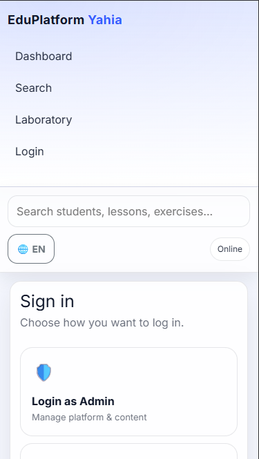
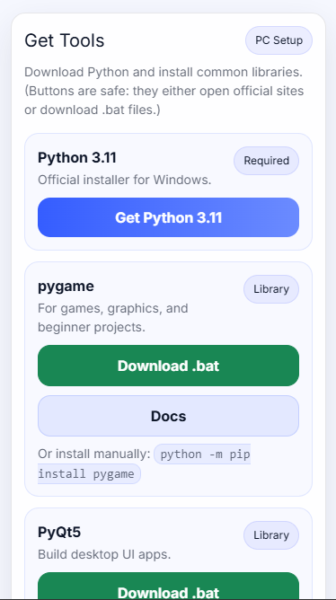
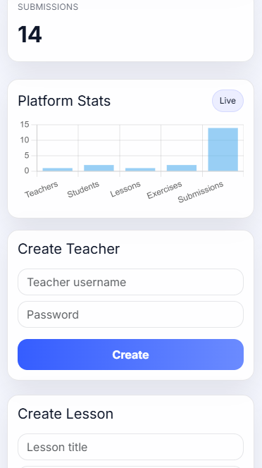
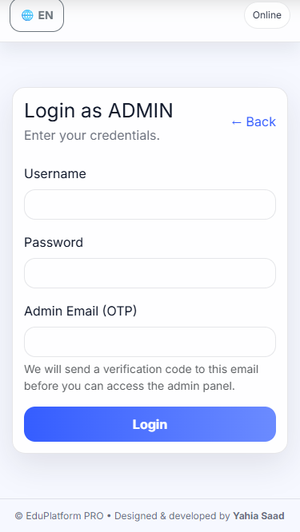

<!-- ========================================================= -->
<!-- ===================== PROJECT BANNER ==================== -->
<!-- ========================================================= -->

<h1 align="center">EduPlatform</h1>

Modern Educational Platform engineered for scalable digital learning

Built with by <b>Yahia Saad</b>

---

## Overview

EduPlatform is a structured and scalable web-based educational system designed to deliver an organized digital learning experience.

The platform focuses on:

* Clean system architecture
* Scalable backend design
* Efficient local deployment
* Structured learning workflows
* Modular development

---

## Core Features

Modular backend architecture  
Database seeding system  
Structured application layout  
Fast local deployment  
Scalable project design  
Clean development workflow  

---

## Application Screenshots

 

---

## Project Structure

EduPlatform/
│
├── app/                # Core application modules
├── instance/           # Database / runtime configuration
├── requirements.txt    # Dependencies
├── run.py              # Main entry point
├── seed.py             # Database initialization
└── README.md

---

## Quick Start

### 1 Clone repository

git clone https://github.com/yahiawork/EduPlatform.git  
cd EduPlatform

---

### 2 Create virtual environment

python -m venv venv

Activate:

Windows  
venv\Scripts\activate

Linux / macOS  
source venv/bin/activate

---

### 3 Install dependencies

pip install -r requirements.txt

---

### 4 Initialize database (optional but recommended)

python seed.py

---

### 5 Run server

python run.py

---

### 6 Open in browser

http://127.0.0.1:5000

---
---

## Environment Configuration (Required)

Before running the platform, you must create a `.env` file in the project root.

This file is required to configure SMTP settings for email functionality.

You must manually provide your own email server credentials.

Steps:

1. Copy `.env.example`
2. Rename it to `.env`
3. Replace SMTP values with your real credentials

Example:

cp .env.example .env

Without configuring SMTP variables, email-related features will not work.

Important:

- Never commit your `.env` file to version control
- Keep credentials private
- Always use environment variables in production

---

## System Architecture (Conceptual)

Client Browser  
      │  
      ▼  
Application Server (run.py)  
      │  
      ▼  
App Modules (app/)  
      │  
      ▼  
Database Instance (instance/)

---

## Development Workflow

seed.py → prepare database  
run.py  → start server  
app/    → feature modules  

---

## Roadmap

* Authentication system
* Admin dashboard
* Course enrollment logic
* REST API expansion
* Real-time features
* Production deployment config

---

## Contributing

1. Fork repository
2. Create feature branch
3. Commit changes
4. Push branch
5. Open pull request

---

## Author

Yahia Saad  
Full Stack Developer

Portfolio  
https://yahiawork.github.io

---

## Support

If you like this project, consider giving it a star

---

## License

MIT License

---

Built with precision engineering
